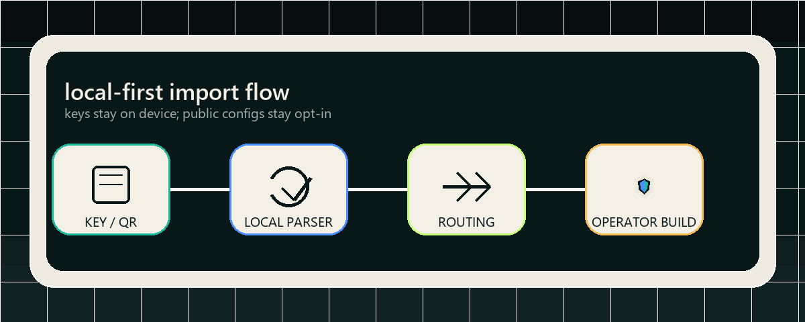

# POKROV Client

<p align="center">
  
</p>

<p align="center">
  <a href="README.md">Language index</a>
  &middot;
  <a href="README.ru.md">Русский</a>
  &middot;
  <a href="docs/OPEN_SOURCE_SCOPE.md">Scope</a>
  &middot;
  <a href="docs/ENTERPRISE.md">Enterprise</a>
  &middot;
  <a href="SECURITY.md">Security</a>
  &middot;
  <a href="BRAND.md">Brand</a>
</p>

<p align="center">
  <a href="LICENSE"></a>
  <a href="https://github.com/Kiwunaka/Pokrov-client/actions/workflows/ci.yml"></a>
  <a href="https://github.com/Kiwunaka/Pokrov-client/releases/tag/v0.172.0-source"></a>
  
</p>

<p align="center">
  <strong>Open client. Private operations. Operator-ready source.</strong>
  <br>
  Android and Windows first. GPLv3. Source-only release.
</p>

---

<p align="center">
  
</p>

## What This Is

POKROV Client is the public source repository for an Android and Windows VPN
client foundation. It contains a sanitized source snapshot, source-release
proof tooling, contribution policy, security routing, community import flows,
and an operator path for teams that want to build their own branded client.

This repository is source-only. It does not publish official APK/EXE binaries,
store builds, trusted Windows signing, private POKROV backend code, billing
systems, admin surfaces, signing material, or private release evidence.

Contract markers:

- no POKROV API calls by default
- does not provide POKROV nodes or a default free service
- forks and operator builds are not official POKROV builds
- Enterprise boundary and commercial license notes live in
  [Enterprise](docs/ENTERPRISE.md); no commercial license is offered by default.

## Flow Preview

<p align="center">
  
</p>

The preview shows the public product shape only: local import, local parsing,
routing controls, and an operator-owned build boundary. It does not claim an
official APK, EXE, store build, trusted signing, or live POKROV service.

## Tracks

### Personal Key Client

For people who already have a key, QR code, or subscription URL.

- Neutral open-source mode without official POKROV branding.
- No POKROV API calls by default.
- Local import for `vless://`, `trojan://`, `ss://`, and `vmess://` keys.
- Android and Windows QR import.
- Subscription URL import and refresh.
- Routing controls and WARP consent boundaries where implemented.
- Optional third-party public config catalog, gated and disabled by default.

### Operator / Company Client

For companies, teams, and communities that want a client for their own service.

Operators are responsible for:

- backend API and managed-profile delivery
- brand, icons, name, package identifiers, and app metadata
- support, privacy policy, abuse handling, and billing
- signing, checksums, release notes, and distribution
- GPLv3 compliance for their distribution

Start with [Operator integration](docs/OPERATOR_INTEGRATION.md),
[Product variants](docs/PRODUCT_VARIANTS.md), and
[White-label branding](docs/WHITE_LABEL_BRANDING.md).

### Official POKROV Service Mode

Official POKROV builds are separate from public forks and operator builds.
Forks must not use official POKROV branding, endpoints, support channels, or
release claims unless a later owner-approved policy explicitly allows it.

## Current Release

| Field | Value |
| --- | --- |
| Source release | [`v0.172.0-source`](https://github.com/Kiwunaka/Pokrov-client/releases/tag/v0.172.0-source) |
| Commit | `e1fef5520190dc6fb0efbe8c1bfd666fac07d2db` |
| Source archive SHA-256 | `84c53d20e5f53253fdaeb5cae1d310327e331c0a462683eb9eee7903d6846367` |
| Platforms | Android and Windows |
| License | GNU GPLv3 |
| Binary assets | None |
| Store release | None |
| Trusted signing claim | None |

## Build From Source

```powershell
git clone https://github.com/Kiwunaka/Pokrov-client.git
cd Pokrov-client
powershell -ExecutionPolicy Bypass -File .\scripts\doctor.ps1
powershell -ExecutionPolicy Bypass -File .\scripts\run-tests.ps1
```

For platform setup, runtime-artifact boundaries, and clean-clone checks, read
[Build from source](docs/BUILD_FROM_SOURCE.md).

## Repository Map

| Path | Purpose |
| --- | --- |
| `apps/android_shell/` | Android host shell and native Android contracts. |
| `apps/windows_shell/` | Windows host shell, runner metadata, and Windows QR host. |
| `packages/app_shell/` | Shared Flutter application shell and product flows. |
| `packages/core_domain/` | Domain models and public contracts. |
| `packages/runtime_engine/` | Runtime staging and connect/disconnect boundary. |
| `packages/platform_contracts/` | Platform-facing contracts. |
| `docs/` | Build, release, operator, security, and governance docs. |
| `scripts/` | Source import, release proof, preflight, and verification tooling. |

## Free VPN Catalog Boundary

The optional Free VPN catalog is a reviewed third-party public config feed
path. It is opt-in, disabled by default, and not an official POKROV node pool.
The client must not promise speed, safety, privacy, uptime, legality, or
availability for third-party public configs.

See [Free VPN catalog gate](docs/FREE_VPN_CATALOG_GATE.md).

## Contributing

Read [CONTRIBUTING.md](CONTRIBUTING.md) before opening a PR.

Good contributions for this stage:

- build-from-source improvements
- parser fixtures and local import tests
- Android/Windows source-build fixes
- operator integration documentation
- source-release and trust-boundary hardening

Do not post secrets, QR payloads, subscription URLs, signing material, private
POKROV endpoints, or vulnerability details in public issues.

## Security

Use [SECURITY.md](SECURITY.md). Public issues are not the right place for
vulnerabilities, private keys, exploit details, or live subscription URLs.

## License

POKROV Client is licensed under the GNU General Public License v3.0. See
[LICENSE](LICENSE).

The POKROV name, logo, official endpoints, release claims, and service
operation remain governed by the brand and official-build boundary in
[BRAND.md](BRAND.md).
