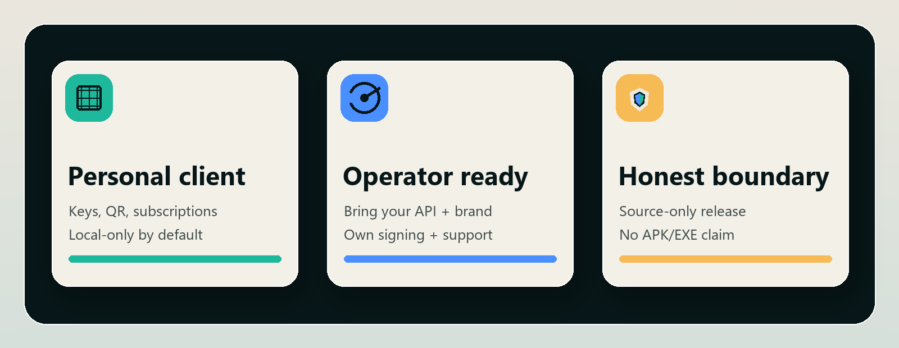

# Documentation Index

This repository is a source-only public client workspace. Start here when you
need to build from source, choose a product track, review the operator contract,
or prepare a source-only release.

<p align="center">
  
</p>

## At A Glance

| Lane | Use it for | First doc |
| --- | --- | --- |
| Personal client | Local keys, QR codes, subscriptions, routing controls, and opt-in third-party public configs. | [Build from source](BUILD_FROM_SOURCE.md) |
| Operator client | Your backend, your brand, your support, your signing, your distribution. | [Operator integration](OPERATOR_INTEGRATION.md) |
| Maintainer trust | Source-only release proof, branch protection, checks, and honest release notes. | [Release policy](RELEASE_POLICY.md) |

## First Steps

- [Build from source](BUILD_FROM_SOURCE.md): local requirements, variants,
  dependency setup, tests, and clean-clone proof.
- [Troubleshooting](TROUBLESHOOTING.md): source checkout, dependency, Android,
  Windows, and clean-clone failure routing.
- [Android device validation](device-validation/android.md): public
  `MANUAL_OWNER_TEST` checklist and local precheck via
  `scripts\android-device-smoke.ps1` for Android release-build device review.
- [Open-source scope](OPEN_SOURCE_SCOPE.md): what is public, what remains
  private, and which claims are not made by this repository.
- [Product variants](PRODUCT_VARIANTS.md): community, operator, and official
  service-mode boundaries.
- [Client product tracks](CLIENT_PRODUCT_TRACKS.md): ordinary-user and
  company/operator client direction.

Before opening a build issue, run the read-only contributor doctor:

```powershell
powershell -ExecutionPolicy Bypass -File .\scripts\doctor.ps1
powershell -ExecutionPolicy Bypass -File .\scripts\doctor.ps1 -Json
```

The doctor checks local commands and required public files. It does not install
dependencies, build artifacts, fetch runtime binaries, copy config, or publish
anything.

## Users And Import

- [Free VPN catalog gate](FREE_VPN_CATALOG_GATE.md): gated third-party public
  config catalog rules and attribution boundaries.
- [GitHub triage](GITHUB_TRIAGE.md): issue routing, labels, and public
  redaction rules.
- [Diagnostics export policy](DIAGNOSTICS_EXPORT_POLICY.md): local-only,
  user-initiated, redacted diagnostics and future log-export boundaries.
- [Governance](GOVERNANCE.md): maintainer-led decision rules and CODEOWNERS
  review routing.
- [Support](../SUPPORT.md): where to ask for help without posting private
  keys, QR payloads, subscription URLs, or backend details.
- [Security](../SECURITY.md): private reporting route for vulnerabilities.

## Operators

- [Operator integration](OPERATOR_INTEGRATION.md): expected backend surfaces,
  first-run operator path, and responsibilities.
- [Enterprise boundary](ENTERPRISE.md) (`docs/ENTERPRISE.md`): GPLv3, commercial license, paid
  services, and operator distribution boundaries.
- [Operator OpenAPI](operator/openapi.yaml): source fixture API contract.
- [White-label branding](WHITE_LABEL_BRANDING.md): neutral token roles and
  operator-owned branding boundary.

## Maintainers

- [Release policy](RELEASE_POLICY.md): source-only release rules.
- [Release checklist](RELEASE_CHECKLIST.md): pre-tag and release evidence
  checks.
- [Release blockers](RELEASE_BLOCKERS.md): machine-readable blocker inventory
  and manual maintainer steps before a source tag, including source tag
  readiness, release merge order, release stack GitHub status, and release
  merge handoff helpers, plus `scripts/prepare-source-publication-packet.ps1`
  for the source publication packet final manual GitHub Release review and
  handoff-carried plus artifact-file fingerprint integrity checks, including
  expected build output root boundaries and source-only allowlists for release
  artifacts, source-only artifact filename contracts, and readable artifact
  content/schema checks.
- [Required checks](REQUIRED_CHECKS.md): CI job names, branch-protection
  guidance, and source-release gates.
- [GitHub ruleset setup](GITHUB_RULESET_SETUP.md): repository ruleset or
  branch protection setup checklist and
  `scripts/check-github-ruleset.ps1` verifier.
- [Source release template](releases/SOURCE_RELEASE_TEMPLATE.md): GitHub
  Release body shape for source-only tags.
- [Source readiness](releases/source-readiness-v0.2-v0.3.md): tracked
  source-only candidates after `v0.1.0-source`.
- [Changelog](../CHANGELOG.md): evidence-honest release history.
- [Dependency license audit](DEPENDENCY_LICENSE_AUDIT.md): reviewed package
  inventory and remaining binary-release boundaries.
- [Dependency update policy](DEPENDENCY_UPDATE_POLICY.md): Dependabot scope,
  review gates, labels, and source-only boundaries.
